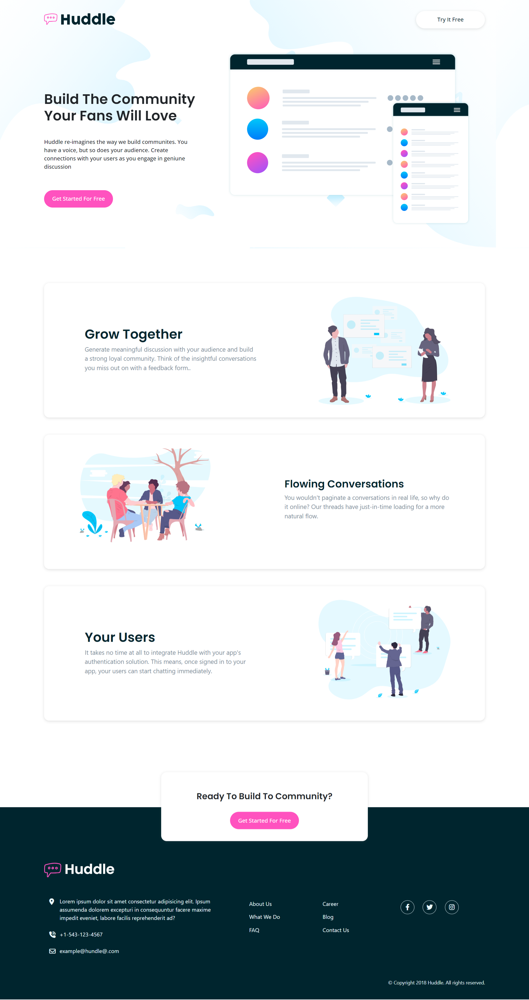

# Frontend Mentor - Huddle landing page with alternating feature blocks solution

This is a solution to the [Huddle landing page with alternating feature blocks challenge on Frontend Mentor](https://www.frontendmentor.io/challenges/huddle-landing-page-with-alternating-feature-blocks-5ca5f5981e82137ec91a5100). Frontend Mentor challenges help you improve your coding skills by building realistic projects. 

## Table of contents

- [Overview](#overview)
  - [Screenshot](#screenshot)
  - [Links](#links)
  - [Built with](#built-with)
  - [Author](#author)

## Overview

### Screenshot
Desktop

Mobile

### Links

- Solution URL: [View Now](https://github.com/Tarun-Githubs/huddle-landing-page)
- Live Site URL: [Live Preview](https://huddle-landing-page-fmc.netlify.app/)

### Built with

- Semantic HTML5 markup
- CSS custom properties
- Bootstrap
- Media Query

### Author
- Frontend Mentor - [@Tarun-Githubs](https://www.frontendmentor.io/profile/Tarun-Githubs)
